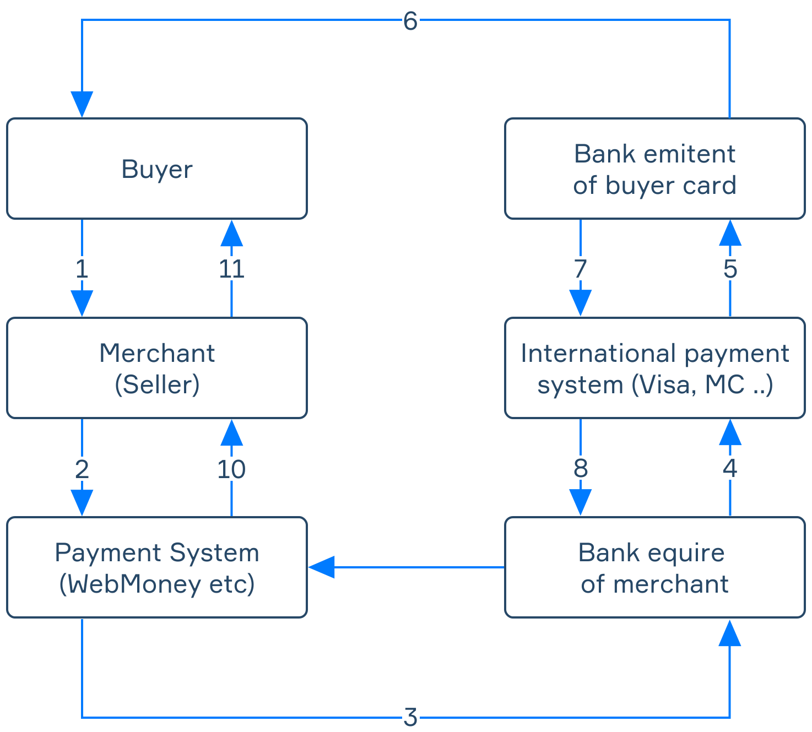
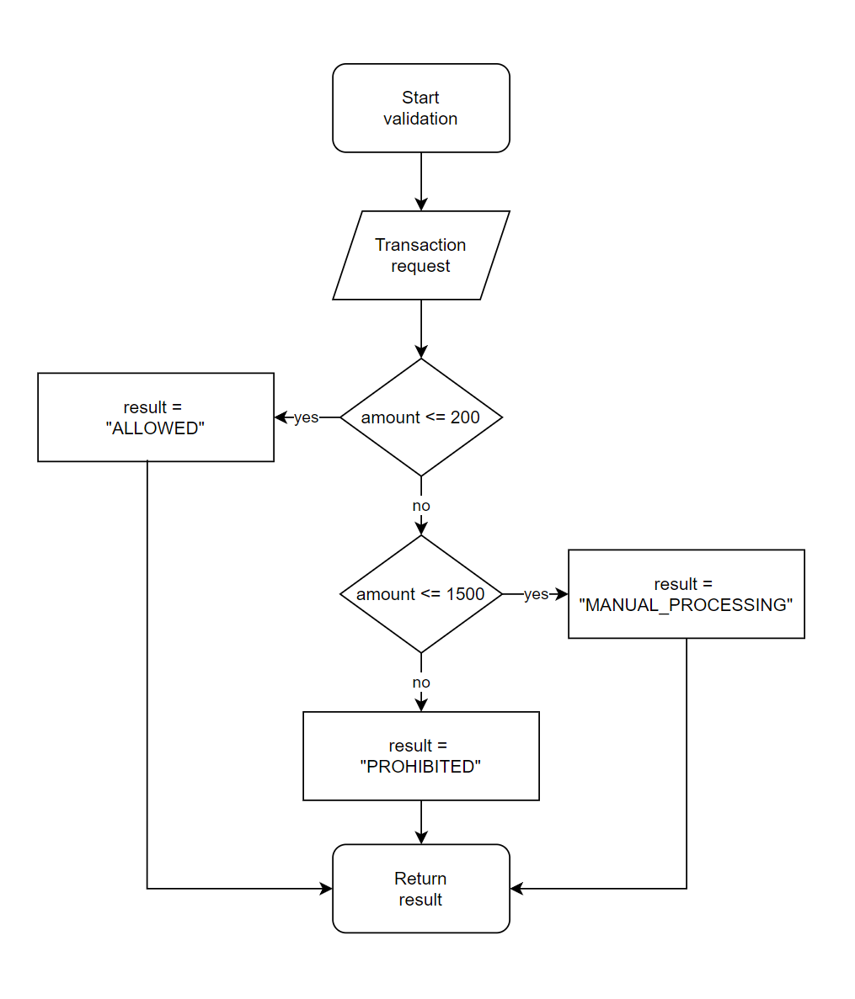

# Stage 1/6: Simple transaction validation
## Description
To begin with, let's define the concepts and find out what makes a good anti-fraud system. Consider the procedure of online payment (a transaction):



Frauds carry significant financial costs and risks for all stakeholders. So, the presence of an anti-fraud system is a necessity for any serious e-commerce platform.

Let's implement a simple anti-fraud system consisting of one rule — <b>heuristics</b>. In the beginning, there's one simple measure that prevents fraudsters from illegally transferring money from an account. Suppose some scammers acquired access to confidential financial information through <b>phishing</b> or <b>pharming</b>. They immediately try to transfer as much as possible. Most of the time, the account holder is not aware of the attack. The anti-fraud system should prevent it before it is too late.

In the first stage, you need to create a simple rest endpoint that calculates whether a transaction is `ALLOWED`, `PROHIBITED`, or requires `MANUAL_PROCESSING` by evaluating the amount of the transaction.

## Objectives
- Create and run a SpringBoot application on the `28852` port;

- Create the `POST /api/antifraud/transaction` endpoint that accepts data in the JSON format:
```json
{
  "amount": <Long>
}
```
- Implement the following rules:
1. Transactions with a sum of lower or equal to `200` are `ALLOWED`;
2. Transactions with a sum of greater than `200` but lower or equal than `1500` require `MANUAL_PROCESSING`;
3. Transactions with a sum of greater than `1500` are `PROHIBITED`.


- The transaction amount must be greater than `0`.
- If the validation process was successful, the endpoint should respond with the status `HTTP OK` (`200`) and return the following JSON:
```json
{
  "result": "<String>"
}
```
- In case of wrong data in the request, the endpoint should respond with the status `HTTP Bad Request` (`400`).

## Examples
<b>Example 1:</b> <i>a POST request for /api/antifraud/transaction</i>

<i>Request body:</i>
```json
{
   "amount": 150
}
```
<i>Response:</i> `200 OK`

<i>Response body:</i>
```json
{
   "result": "ALLOWED"
}
```

<b>Example 2:</b> <i>a POST request for /api/antifraud/transaction</i>

<i>Request body:</i>
```json
{
   "amount": 870
}
```
<i>Response:</i> `200 OK`

<i>Response body:</i>
```json
{
   "result": "MANUAL_PROCESSING"
}
```
<b>Example 3:</b> <i>a POST request for /api/antifraud/transaction</i>

<i>Request body:</i>
```json
{
   "amount": 1700
}
```
<i>Response:</i> `200 OK`

<i>Response body:</i>
```json
{
   "result": "PROHIBITED"
}
```
<b>Example 4:</b> <i>a POST request for /api/antifraud/transaction</i>

<i>Request body:</i>
```json
{
   "amount": -1
}
```
<i>Response:</i> `400 BAD REQUEST`
